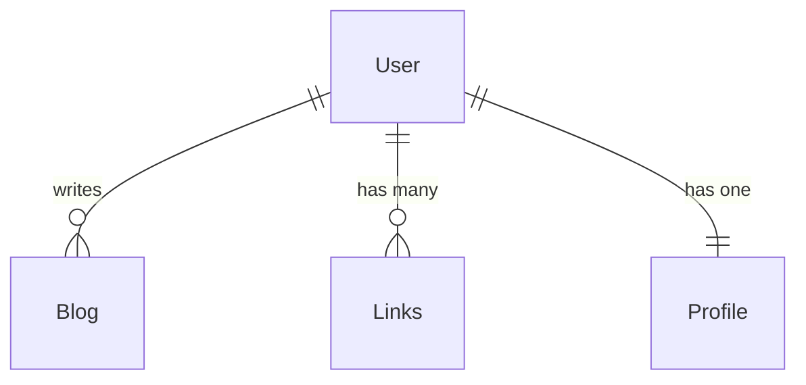
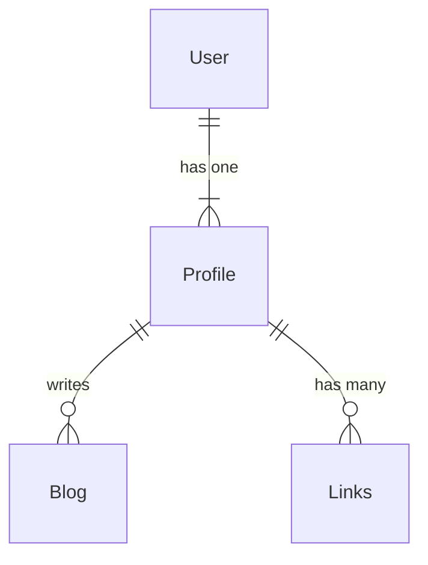

# Diagram

```mermaid
erDiagram
    x[User]
    p[Profile]
    b[Blog]
    l[Links]

    x||--o{b : "writes"
    x||--o{l : "has many"
    x||--||p : "has one"
```

or 

```mermaid
erDiagram
    x[User]
    p[Profile]
    b[Blog]
    l[Links]

    x||--|{p : "has one"
    p||--o{b : "writes"
    p||--o{l : "has many"
```