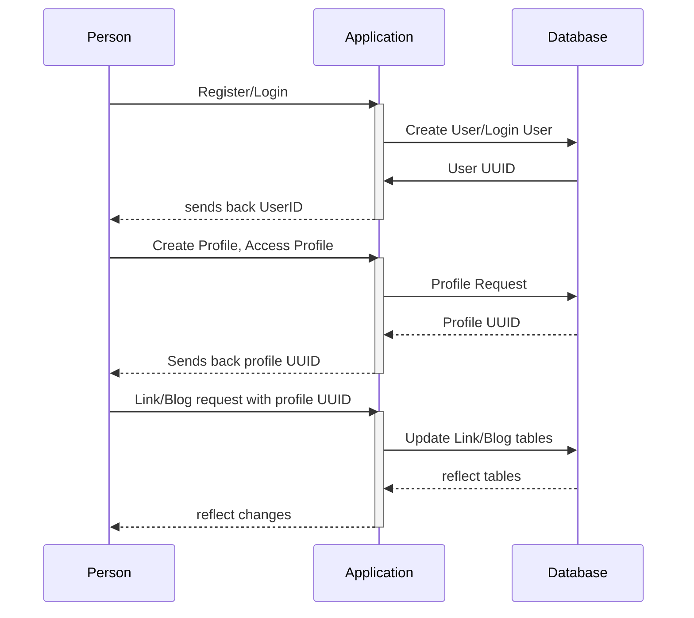

# Expected flow

```mermaid
sequenceDiagram
    participant p as Person
    participant API as Application
    participant DB as Database

    p ->> API: Register/Login
    activate API
    API ->> DB: Create User/Login User
    DB ->> API: User UUID
    API -->> p: sends back UserID
    deactivate API

    p ->> API: Create Profile, Access Profile
    activate API
    API ->> DB: Profile Request
    DB -->> API: Profile UUID
    API -->> p: Sends back profile UUID
    deactivate API

    p ->> API: Link/Blog request with profile UUID
    activate API
    API ->> DB: Update Link/Blog tables
    DB -->> API: reflect tables
    API -->> p: reflect changes
    deactivate API
```